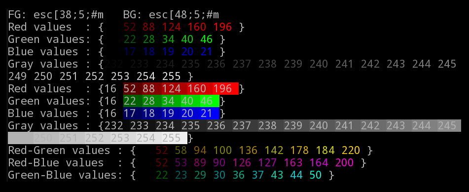

A little script, currently in perl, to generate color codes for
single, gray, and multi-color gradients.

The text output, without colors, is:

FG: esc[38;5;#m   BG: esc[48;5;#m
Red values  : {16 52 88 124 160 196 }
Green values: {16 22 28 34 40 46 }
Blue values : {16 17 18 19 20 21 }
Gray values : {232 233 234 235 236 237 238 239 240 241 242 243 244 245 249 250 251 252 253 254 255 }
Red values  : {16 52 88 124 160 196 }
Green values: {16 22 28 34 40 46 }
Blue values : {16 17 18 19 20 21 }
Gray values : {232 233 234 235 236 237 238 239 240 241 242 243 244 245 249 250 251 252 253 254 255 }
Red-Green values : {16 52 58 94 100 136 142 178 184 220 }
Red-Blue values  : {16 52 53 89 90 126 127 163 164 200 }
Green-Blue values: {16 22 23 29 30 36 37 43 44 50 }
